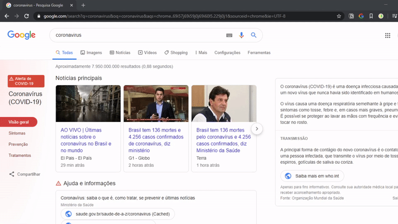
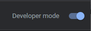
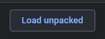
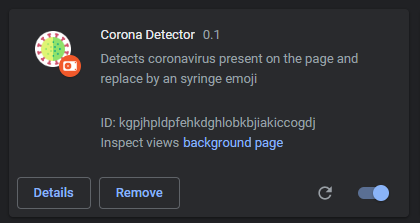

<p align="center">
  
</p>
<h1 align="center">
  Coronavirus Detector
</h1>

## :clipboard: Description
Coronavirus Detector is a chrome extension that detects coronavirus present on the page by clicking on the extension.



## :rocket: Getting Started

1.	**Download the repository**
  ```sh
    git clone https://github.com/henry-ns/coronavirus-detector.git
  ```

2. Enter on chrome extensions
  ```
    chrome://extensions/
  ```

3. Enable development mode on chrome extensions page
   
  

5. Load unpacked extension, select the current folder
   
  

If everything went as it should, you should see this:

